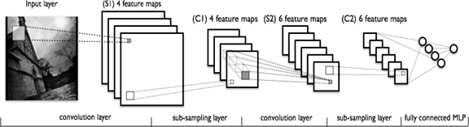
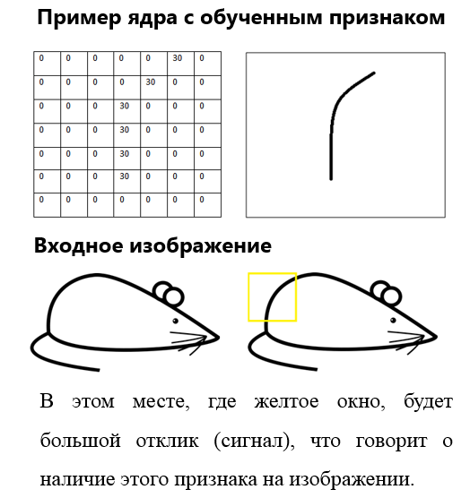
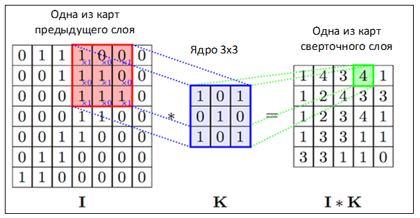
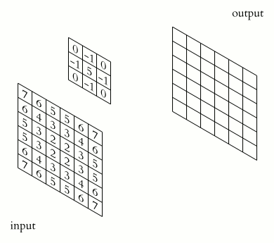
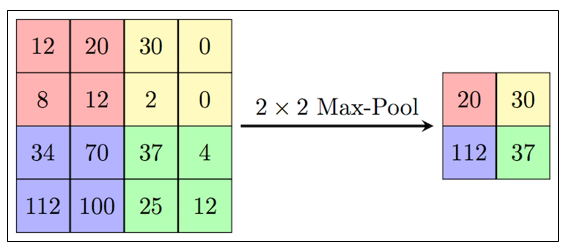
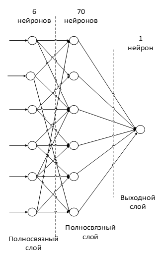

# Пример задачи классификации с помощью нейронной сети
> Задача обучить модель для классификации изображений по классом. На пример на вход передается изображения с автомабилом,нейросеть должен определить кокому классу относится это изображение
> Выполнение этой задачи эффективнее используется сверточная нейронная сеть.
>
> Сверточной нейронной сети состоит из разных видов слоев: сверточные (convolutional) слои, субдискретизирующие (subsampling, подвыборка) слои и слои «обычной» нейронной сети – персептрона, в соответствии с рисунком
>
> 

> # Входной слой
>
> Входные данные представляют из себя цветные изображения типа JPEG, размера 32х32 пикселей. Если размер будет слишком велик, то вычислительная сложность повысится, соответственно ограничения на скорость ответа будут нарушены, определение размера в данной задаче решается методом подбора.
>
> Входной слой учитывает двумерную топологию изображений и состоит из нескольких карт (матриц), карта может быть одна, в том случае, если изображение представлено в оттенках серого, иначе их 3, где каждая карта соответствует изображению с конкретным каналом (красным, синим и зеленым).
>
> Входные данные каждого конкретного значения пикселя нормализуются в диапазон от 0 до 1, по формуле:

> # Сверточный слой
>
> Сверточный слой представляет из себя набор карт (другое название – карты признаков, в обиходе это обычные матрицы), у каждой карты есть синаптическое ядро (в разных источниках его называют по-разному: сканирующее ядро или фильтр).
>
> Ядро представляет собой систему разделяемых весов или синапсов, это одна из главных особенностей сверточной нейросети. В обычной многослойной сети очень много связей между нейронами, то есть синапсов, что весьма замедляет процесс детектирования. В сверточной сети – наоборот, общие веса позволяет сократить число связей и позволить находить один и тот же признак по всей области изображения.
>
> 
>
> Изначально значения каждой карты сверточного слоя равны 0. Значения весов ядер задаются случайным образом в области от -0.5 до 0.5. Ядро скользит по предыдущей карте и производит операцию свертка, которая часто используется для обработки изображений, формула:
>
> Неформально эту операцию можно описать следующим образом — окном размера ядра g проходим с заданным шагом (обычно 1) все изображение f, на каждом шаге поэлементно умножаем содержимое окна на ядро g, результат суммируется и записывается в матрицу результата, как на рисунке 4.
>
> 
> 
>Рисунок 4 — Операция свертки и получение значений сверточной карты (valid)
> 
> 
>
>Операция свертки и получение значений сверточной карты. Ядро смещено, новая карта получается того же размера, что и предыдущая (same)

> # Подвыборочный слой
>
> Обычно в подвыборочном слое применяется функция активации RelU. Операция подвыборки (или MaxPooling – выбор максимального) в соответствии с рисунком 6.
>
> 
>
> Рисунок 6 — Формирование новой карты подвыборочного слоя на основе предыдущей карты сверточного слоя. Операция подвыборки (Max Pooling)

> # Полносвязный слой
>
> Последний из типов слоев это слой обычного многослойного персептрона. Цель слоя – классификация, моделирует сложную нелинейную функцию, оптимизируя которую, улучшается качество распознавания.
> 
> 
>
> Нейроны каждой карты предыдущего подвыборочного слоя связаны с одним нейроном скрытого слоя. Таким образом число нейронов скрытого слоя равно числу карт подвыборочного слоя, но связи могут быть не обязательно такими, например, только часть нейронов какой-либо из карт подвыборочного слоя быть связана с первым нейроном скрытого слоя, а оставшаяся часть со вторым, либо все нейроны первой карты связаны с нейронами 1 и 2 скрытого слоя.

> # Выходной слой
>
> Выходной слой связан со всеми нейронами предыдущего слоя. Количество нейронов соответствует количеству распознаваемых классов.

> # Обучающие выборки использующиеся в экспериментах
>
> В качестве обучающих примеров использовалась база данных CIFAR10, она содержит огромное изображение, которые разбиты по классом. Всего 50000 изображений, 10 класс. Общий вес этой базы составляет 1.3 GB.
> 
>         
> 
> В качестве тестывих примеров использовалась тот же база данных CIFAR10, 10000 изображений, 10 класс.
> 

> # Результаты
> 
> 
> Такой нейронний сеть обучалось 30 эпох, и в теством выборке удалось получить 9112 правилных ответов из 10000
> 
> Если делаем выводы:
> 
> > Сверточные нейронные сети обеспечивают частичную устойчивость к изменениям масштаба, смещениям, поворотам, смене ракурса и прочим искажениям.
>
> > Ядро — представляет из себя фильтр, который скользит по всему изображению и находит признаки лица в любом его месте (инвариантность к смещениям).
>
> > Подвыборочный слой дает:
> >
> > > увеличение скорости вычислений (минимум в 2 раза), за счет уменьшение размерности карт предыдущего слоя;
> >
> > > фильтрация уже ненужных деталей;
> >
> > > поиск признаков более высокого уровня (для следующего сверточного слоя).
>
> > Последние слои – слои обычного многослойного персептрона. Два полносвязных и один выходной. Этот слой отвечает за классификацию, с математической точки зрения моделирует сложную нелинейную функцию, оптимизируя которую улучшается качество распознавания. Число нейронов в слое 6 по числу карт признаков подвыборочного слоя.
> 
> Возможные улучшения
> 
> > рассмотреть нейросети Fast-RCNN, YOLO;
> 
> > распараллеливание процесса обучения на графические процессоры;
> 
> > использование Android NDK (C++) для улучшения производительности
